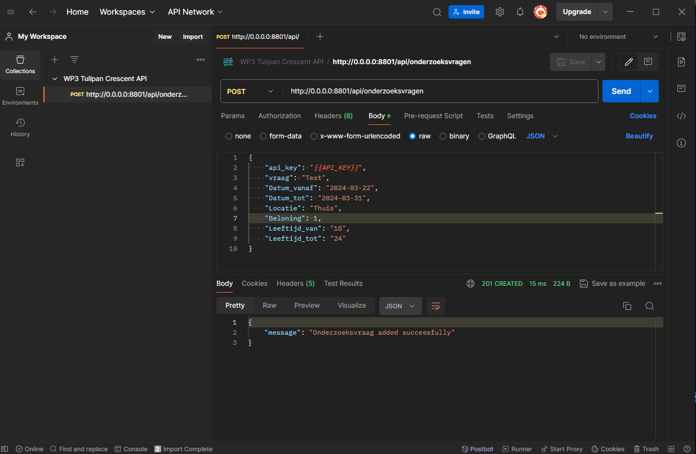

<!-- PROJECT LOGO -->
<br />
<div align="center">
  <a href="https://github.com/othneildrew/Best-README-Template">
    
  </a>

  <h3 align="center">WP3 Tulipan Crescent</h3>
</div>


<!-- ABOUT THE PROJECT -->
## Over het project

Stichting Accessibility heeft als missie een inclusieve samenleving te bevorderen, waarin alle mensen, met of zonder beperking, gelijkwaardig kunnen participeren. Dat is een mooi streven en gaat hand in hand met het besef van bedrijven en organisaties dat het belangrijk is om hun producten en diensten toegankelijk te maken voor iedereen.

Met het oog op het doen van onderzoek naar de huidige toegankelijkheid en het indienen van verbetervoorstellen, wil Stichting Accessibility een webapplicatie laten ontwikkelen. Deze applicatie is bedoeld om een panel van ongeveer 125 mensen met een beperking samen te brengen met organisaties en bedrijven. Hierin wil Stichting Accessibility een rol nemen als poortwachter, om onderzoek uitvragen en ervaringsdeskundigen zorgvuldig geselecteerd bij elkaar te krijgen. Omdat het om een kwetsbare doelgroep gaat zal de Stichting Accessibility de gegevens van de ervaringsdeskundigen beheren en alle acties in het proces goedkeuren. Daarbij spelen twee aspecten een grote rol: toegankelijkheid van de applicatie en informatiebeveiliging.


<!-- GETTING STARTED -->
## Installatie

Volg de volgende stappen goed.

### Inlog gegevens

Gegevens staan in username:password style.

* Admin login
  ```sh
  admin:admin
  ```
* Ervaringsdeskundige login
```sh
deskundige:deskundige
```

### Git clone


1. Clone de repo
   ```sh
   git clone https://github.com/Rac-Software-Development/wp3-2024-rest-1b2-tulipan-crescent.git
   ```
2. Install de requirements
   ```sh
   pip install -r requirements.txt
   ```
3. Postman staat klaar in de root folder
   ```js
   https://github.com/Rac-Software-Development/wp3-2024-rest-1b2-tulipan-crescent/blob/main/WP3%20Tulipan%20Crescent%20API.postman_collection.json
   ```


<!-- USAGE EXAMPLES -->
## Gebruik

Postman:

